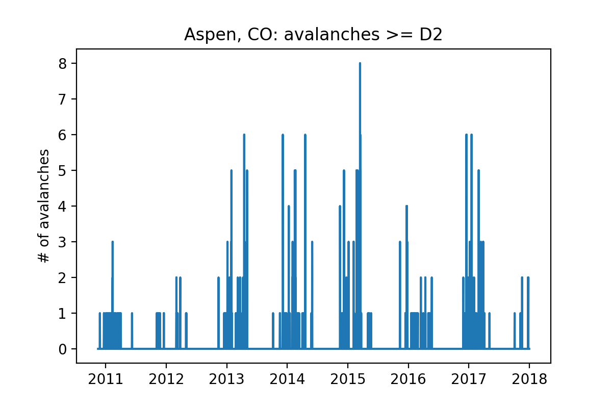

Readme
## Empirical avalanche prediction in Colorado:
#### Can a machine-learning model trained on historical climatic and avalanche data augment prediction of avalanche risk?

### Data:
__CAIC Avalanche data__

10 backcountry zones:

avalanche observation data back to 1980:

__weather data__
SNOTEL sensor network:

_source: NRCS National Water and Climate Center, USDA_

Local Climatalogical Data (commonly airports):

### EDA/ data trends:
__destructive size:__

_this modeling approach will consider avalanches D2 or greater_

__D2+ avalanches by backcountry zone:__
Northern San Juan        2998
Front Range              1565
Vail & Summit County     1337
Aspen                    1210
Gunnison                 1188
Sawatch Range             806
Southern San Juan         585
Steamboat & Flat Tops     186
Grand Mesa                155
Sangre de Cristo           22

__snow angle:__ (this is well understood science)

### modeling strategy:
__Data:__  
 - _features:_ wind data from Aspen and Leadville airports, air temperature and precipitation data from Independence Pass SNOTEL station
 - _target:_ Aspen Zone avalanches, # per day (size >= D2)
 - _train and test split:_ June 2016

__preliminary model:__
 - train/test split: June 2016
 - linear regression cval training score = -0.013
 - linear regression test rmse = 16.840
 - linear L1 regression cval training score = -0.025
 - linear L1 regression test rmse = 16.871
 - gbr cval training score = -0.138
 - gbr test rmse = 19.079

__remove summer, add jday__:
linear regression cval training score = -0.126
linear regression test rmse = 16.848

linear L1 regression cval training score = -0.120
linear L1 regression test rmse = 16.853

gbr cval training score = -0.285
gbr test rmse = 18.193 # THIS IS BROKEN

rfr cval training score = -0.749
rfr test rmse = 16.231

__best gbr model:__
linear regression cval training score = -0.126
linear regression test rmse = 16.848

linear L1 regression cval training score = -0.120
linear L1 regression test rmse = 16.853

gbr cval training score = -0.129
gbr test rmse = 16.683

rfr cval training score = -0.788
rfr test rmse = 16.492

model:

model training:

__aspen and leadville airports__
linear regression cval training score = -0.142
linear regression test rmse = 16.895
linear L1 regression cval training score = -0.136
linear L1 regression test rmse = 16.905
gbr cval training score = -0.105
gbr test rmse = 17.239
rfr cval training score = -0.682
rfr test rmse = 16.441

 __Oversample low-probability avalanches__
class imbalance problem :

 frequency of avys/day:
  - n = 2004
  - In [27]: counts
  - Out[27]: {0: 1533, 1: 381, 2: 42, 3: 20, 4: 7, 5: 12, 6: 8}

 balance to 1:
  - n = 3977 if balanced to 1
  - In [29]: factors
  - Out[29]: {1: 1, 2: 9, 3: 19, 4: 54, 5: 31, 6: 47}

 balance to 0:
  - n = 11522
  - In [25]: factors
  - Out[25]: {0: 1, 1: 4, 2: 36, 3: 76, 4: 219, 5: 127, 6: 191}

## image of stacked models here

__features removed after PCA__
aspen and leadville DAILYAverageWindSpeed

linear L1 regression cval training score = -13.414
linear L1 regression test rmse = 48.547

gbr cval training score = -7.013
gbr test rmse = 20.061

rfr cval training score = -3.602
rfr test rmse = 19.435

__polynomial spline the features:__

finally starting to capture some of the behavior

 poly 2:
 - gbr poly training score = -6.985
 - gbr poly test rmse = 19.931

 poly 3:
 - gbr poly training score = -6.455
 - gbr poly test rmse = 19.597

 poly 4:
 - gbr poly training score = -6.507
 - gbr poly test rmse = 19.742

 __feature engineer timeseries__
next step: incorporate time_series info over a 3-day window
feature engineer features for d-1, d-2, and d-3

linear L1 regression cval training score = -11.206
linear L1 regression test rmse = 41.282

gbr cval training score = -0.217
gbr test rmse = 20.737

rfr cval training score = 0.369
rfr oob score = 0.99
rfr test rmse = 17.444
rfr test rmse = 17.504

_gradient boost_

_random forest lag 3_

- rfr out-of-bag train scoer = 0.990
- rfr test rmse = 17.665

top10:
[('jday', 0.20043948108460471),
 ('D2_up_1', 0.13346396440044575),
 ('airtemp_min_C', 0.10426209756294046),
 ('precip_incr_m_3', 0.060066158957303696),
 ('leadville_Daily_peak_wind', 0.054397151331221458),
 ('airtemp_max_C_3', 0.044317329381161702),
 ('aspen_Daily_peak_wind', 0.033723765724953503),
 ('airtemp_max_C', 0.026307078962837058),
 ('D2_up_2', 0.022604779839308867),
 ('airtemp_max_C_1', 0.022452107517966492),

_random forest lag 4_

- rfr out-of-bag train score = 0.992
- rfr test rmse = 16.392

top10:
[('jday', 0.10622651180694542),
 ('D2_up_1', 0.09539053417592247),
 ('airtemp_min_C', 0.086932104064595381),
 ('aspen_Daily_peak_wind_4', 0.049656589938466222),
 ('airtemp_min_C_4', 0.048195145825449877),
 ('D2_up_4', 0.041812785245372859),
 ('leadville_Daily_peak_wind', 0.040931096995199319),
 ('aspen_SustainedWindSpeed_4', 0.039732629147681685),
 ('leadville_SustainedWindSpeed_4', 0.038886095176397406),
 ('airtemp_max_C_4', 0.037557731549252904),

_random forest lag 5_
rfr test rmse = 16.881
oob = 0.993

top10:
[('jday', 0.1046585942072585),
 ('D2_up_1', 0.099363263450889527),
 ('airtemp_min_C', 0.089679111188733049),
 ('D2_up_5', 0.064841454524787664),
 ('leadville_Daily_peak_wind', 0.049951875451213441),
 ('aspen_Daily_peak_wind_4', 0.043900514813064818),
 ('aspen_SustainedWindSpeed_4', 0.043713467545199031),
 ('airtemp_mean_C', 0.026853162364956974),
 ('airtemp_max_C_4', 0.023893955872820082),
 ('airtemp_max_C', 0.022009094938969978),

__least important features"__
 - _precip start m_ for all days
 - _month_ if lag >3

__lagged with poly splines__
poly 2:
gbr poly training score = -0.594
gbr poly test rmse = 19.292

_gradient boost with lag3, poly2_
 

  best: rfr with poly 2
  - rfr poly test rmse = 17.711
  - looks worse than non-poly

poly 3:
gbr poly training score = -0.394
gbr poly test rmse = 18.502

## model selection 1: train/test performance
__best model:__ random forest regressor
- features: balanced classes, 4-day time-lagged features
- model performance:
  - out-of-bag training score = 0.992
  - test RMSE = 16.392

__second best model:__ gradient boosting regressor _(with same features)_
 - model performance
   - 10-fold cross-validated training score = -0.217
   - test RMSE = 20.737

## model selection 2: use of feature space
__random forest regressor:__

 __gradient boosting regressor:__
 

## model selection 3: receiver operating characteristic
__the goal:__ predict the risk of avalanches
 - a predicted __risk__ is more useful than a predicted #

__classify predictions:__ ordinal --> binary
 - select threshold
 - if number of avalanches >= threshold, 1, else 0
 - compare predictions and true record of events

__Receiver Operating Characteristic:__
 

 - ROC compares True Positive rate to False Positive rate
 - for risk prediction:
   - false positives are OK
   - true positives must be maximized
   - false negatives must be penalized (danger zone)
     - maximize recall

__model selection summary:__
  - random forest regressor
  - choose a threshold to maximize recall

## decisions for model implementation: accuracy, precision, recall
_prediction range goes up to 6..._

_...but performance hard to interpret at predictions >= 1_

__limit prediction range between 0 and 1:__

__most accurate and precise model:__ threshold = 0.75
 - best if your goal is to see an avalanche
 - accuracy = 0.782
 - precision = 0.632
 - recall= 0.381

|          |predicted 0| predicted 1|
|----------|----------|-----------|
|__actual 0__   |       298|        70|
|__actual 1__   |        25|         43|

__balanced model with high recall:__ threshold = 0.46
 - most conservative model for risk forecasting
 - recall= 0.735
 - accuracy = 0.713
 - precision = 0.466

|          |predicted 0| predicted 1|
|----------|----------|-----------|
|__actual 0__   |       228|        30|
|__actual 1__   |        95|         83|

### improvements:
 - __more data!__ models need a longer data record (and more backcountry zones) to train
__more flexible models__: hard to capture the highly variable nature of a stochastic natural process
