Readme
## Empirical avalanche prediction in Colorado:
#### Can a machine-learning model trained on historical climatic and avalanche data augment prediction of avalanche risk?

__A capstone project for the Galvanize Data Science Immersive.__

_source: Staying Alive in Avalanche Terrain, Bruce Tremper, The Mountaineers Books_

__DISCLAIMER:__ This information is NOT intended to be used as an avalanche risk forecast. This is an empirical study done for scientific purposes. Refer to the professionals for avalache forecasts:

http://avalanche.state.co.us

## Preliminary work (as of April 24, 2018)

### Data:
__Colorado Avalanche Information Center data__

(Colorado Department of Natural Resources)

10 backcountry zones:

avalanche observation data back to 1980:

__weather data__
SNOTEL sensor network (NRCS, USDA):

_source: NRCS National Water and Climate Center, USDA_

Local Climatalogical Data (commonly airports):

### avalanche trends:
__destructive size:__

_this modeling approach will consider avalanches D2 or greater_

__D2+ avalanches by backcountry zone:__
- Northern San Juan        2998
- Front Range              1565
- Vail & Summit County     1337
- Aspen                    1210
- Gunnison                 1188
- Sawatch Range             806
- Southern San Juan         585
- Steamboat & Flat Tops     186
- Grand Mesa                155
- Sangre de Cristo           22

### modeling strategy:

__preliminary study: Aspen zone__

__Data:__  
 - _features:_ wind data from Aspen and Leadville airports, air temperature and precipitation data from Independence Pass SNOTEL station
 - _target:_ Aspen Zone avalanches, # per day (size >= D2)
 - _train and test split:_ June 2016

__improvements to feature matrix:__
 - remove summer months (no avalanches possible)
 - add day and month (seasonal dependency)

__preliminary linear model:__
 - linear L1 regression cval training score = -0.025
 - linear L1 regression test rmse = 16.871

 - avalanches are stochastic phenomena dependent on non-linear processes
 - linear model can 'guess low' every time, high penalty for departure from mean
 - need a more flexible model

__preliminary gradient boosting regression model:__

 - gbr cval training score = -0.129
 - gbr test rmse = 16.683

 |model             |  training |
 |:-------------------------:|:-------------------------:|
 |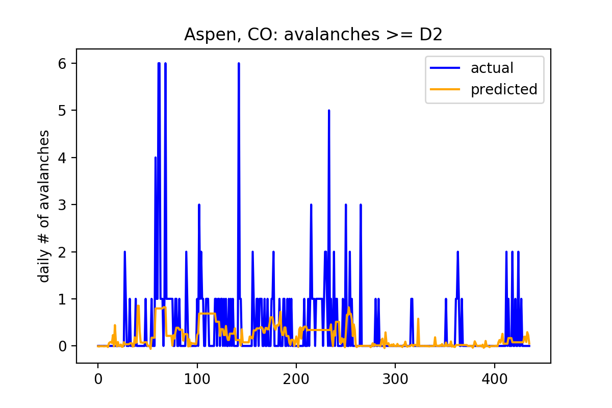  |  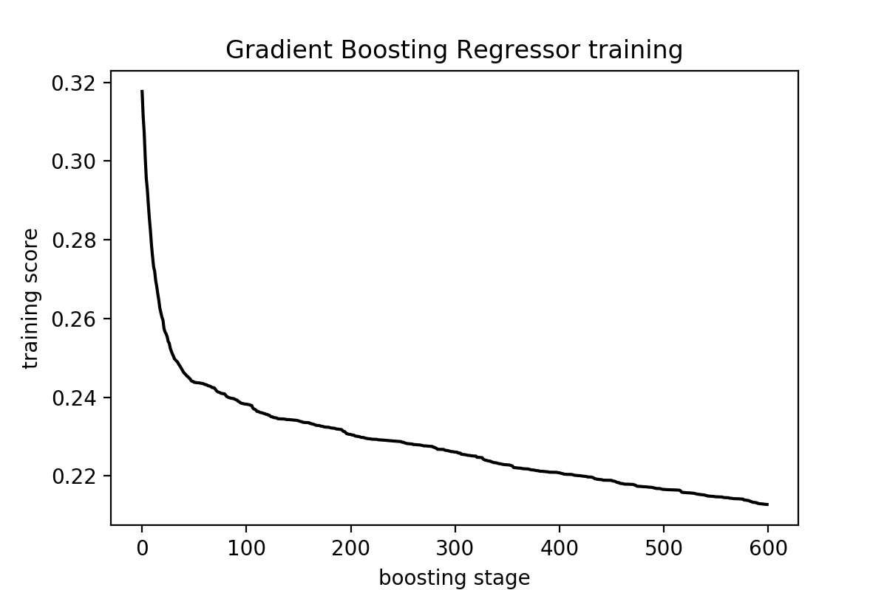|

 - starting to capture non-linear behavior
 - takes many boosting stages (600+) to train the model:

 __Addressing the class imbalance problem:__
 -  classes are highly imbalanced

 frequency of avalanches/day:
 - {0: 1533, 1: 381, 2: 42, 3: 20, 4: 7, 5: 12, 6: 8}

 factors to balance classes:
  - {0: 1, 1: 4, 2: 36, 3: 76, 4: 219, 5: 127, 6: 191}

class-balanced gbr model:

 _moving in the right direction..._
 - stochastic behavior: can now predict values > 2
 - still not a good fit

__other experiments:__
 - PCA to remove features: inconclusive
 - polynomial features to incorporate time-smoothed information: poor performance

 __incorporate time-series information: feature engineering__
 - processes that create avalanches are highly time-sequence dependent
 - strategy: engineer features for past days over time window

 

gradient boost, lag = 3 days:

|model             |  training|
|:-------------------------:|:-------------------------:|
|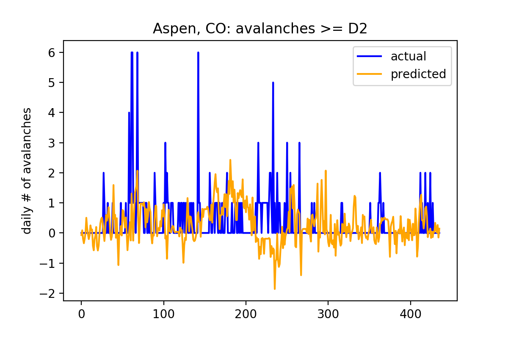  |  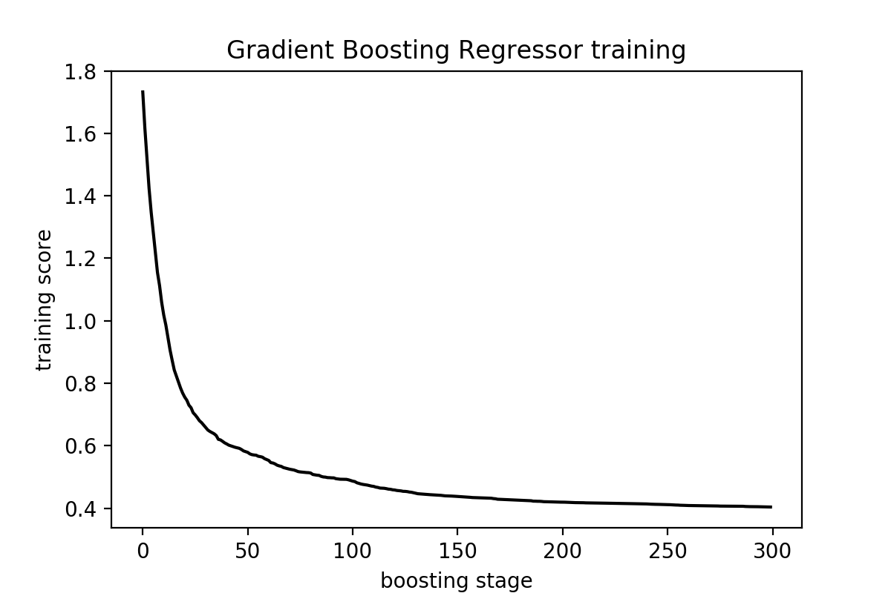|

random forest lag, = 3 days:

 _now we're getting somewhere..._
  - much better accuracy
  - training faster

 process: test models with time lags from 1 to 5 days

## model selection 1: train/test performance
- features: balanced classes, 4-day time-lagged features

|random forest regressor            |  gradient boosting regressor|
|:-------------------------:|:-------------------------:|
|   out-of-bag training score = 0.992 | cross-validated training score = -0.217 |
|  test RMSE = 16.392 | test RMSE = 20.737 |
|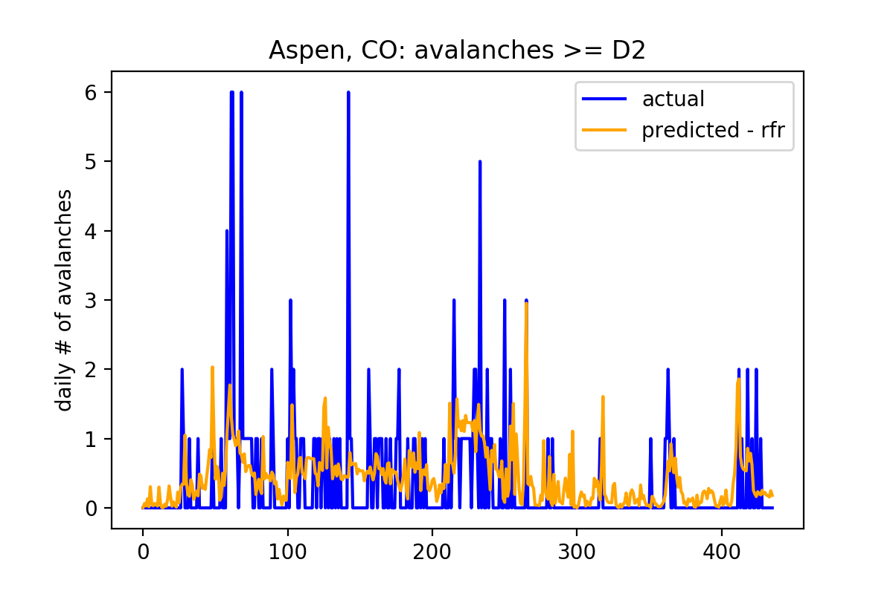  |  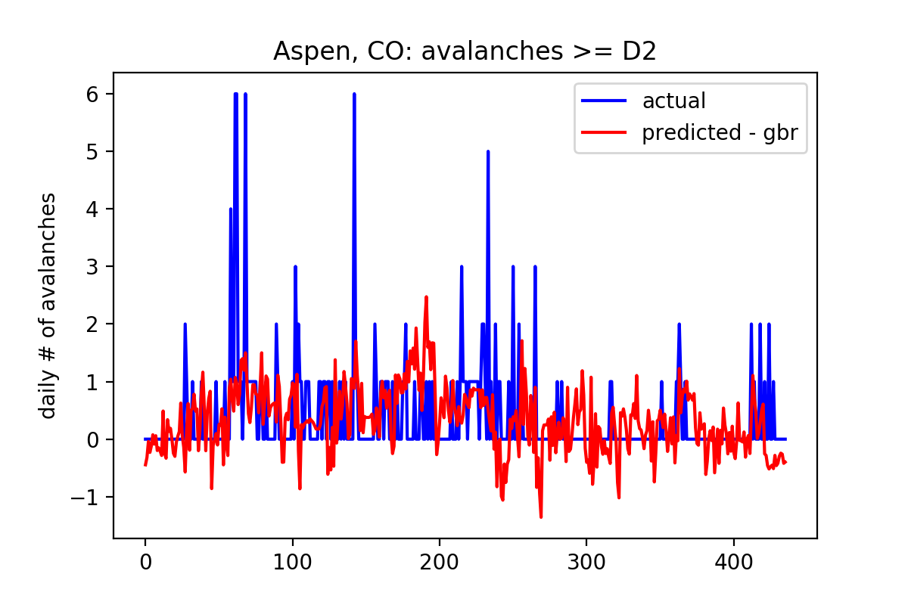 |

## model selection 2: use of feature space
|random forest regressor             |  gradient boosting regressor |
|:-------------------------:|:-------------------------:|
|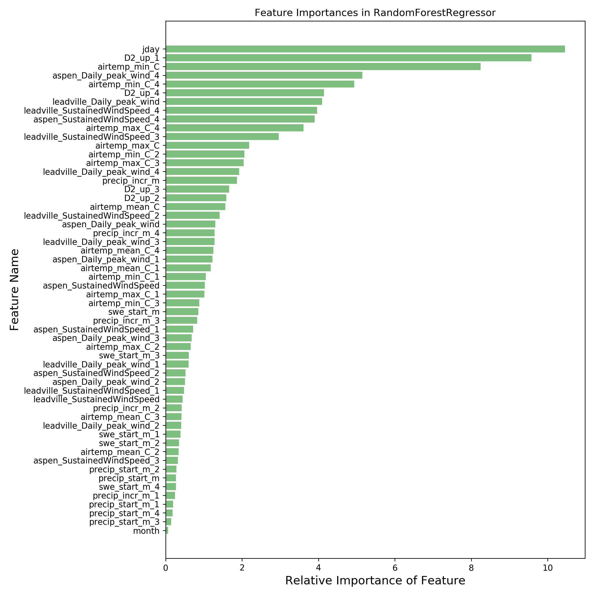  |  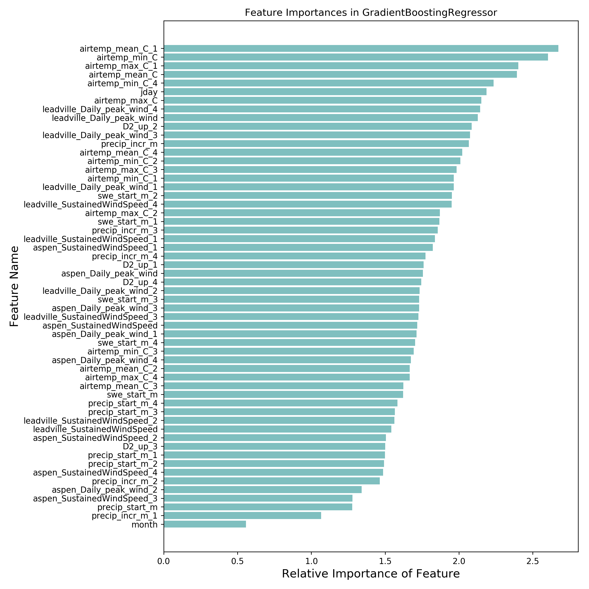|

 - random forest model can be trained with fewer features

 - top features:
   - __day-of-year__
   - number of __avalanches__ yesterday
   - nightly __low air temp__ last night
   - peak __wind speed__ at Aspen airport
   - nightly __low air temp__ 4 days ago
   - number of __avalanches__ 4 days ago
   - peak __wind speed__ at Leadville airport
   - sustained __wind speed__ at Leadville 4 days ago
   - sustained __wind speed__ at Aspen 4 days ago
   - daily __high air temp__ 4 days ago

- notes:
  - day-of-year, # of avalanches, wind speed, and air temp
  - no precip
  - high and low air temps: winter/spring domain problem

## model selection 3: receiver operating characteristic
__the goal:__ predict the risk of avalanches
 - a predicted __risk__ is more useful than a predicted #

__classify predictions:__ ordinal --> binary
 - select threshold
 - 1 if number of avalanches >= threshold, else 0
 - compare predictions and true record of events

__Receiver Operating Characteristic:__

 

 - ROC compares True Positive rate to False Positive rate
 - for risk prediction:
   - false positives are OK
   - true positives must be maximized
   - false negatives must be penalized (danger zone)
     - maximize recall

__selected model random forest regressor:__
  - better ROC metrics (higher accuracy and recall)
  - can be trained with fewer features
  - doesn't predict negative values

__next step:__ choose a threshold to maximize recall

## decisions for model implementation: accuracy, precision, recall
_true range goes up to 6, but prediction range doesn't..._

|accuracy, precison, recall            |  ROC |
|:-------------------------:|:-------------------------:|
|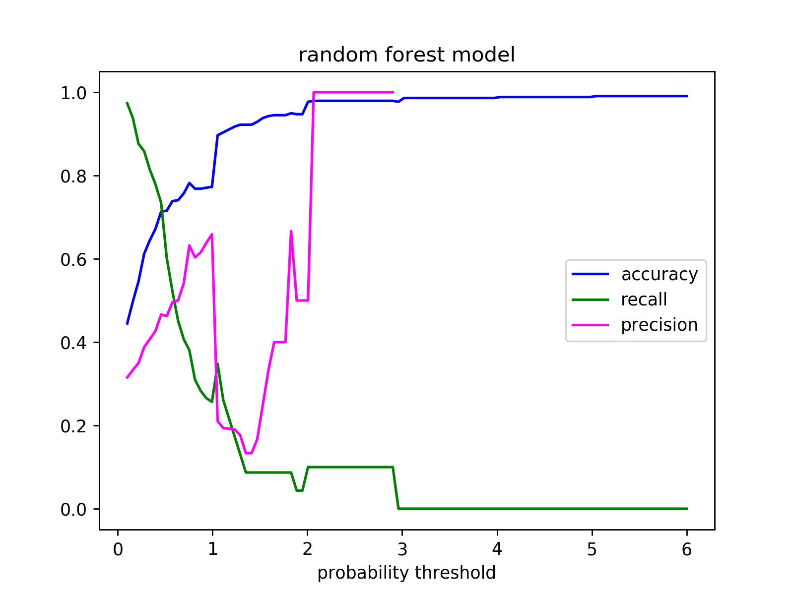  |  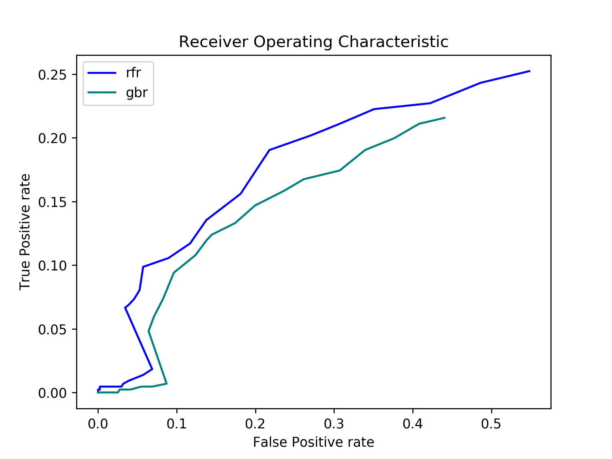|

_...performance hard to interpret at predictions >= 1_

__limit prediction range between 0 and 1:__

__most accurate and precise model:__ threshold = 0.75
 - best if your goal is to see an avalanche
 - accuracy = 0.782
 - precision = 0.632
 - recall= 0.381

|          |predicted 0| predicted 1|
|----------|----------|-----------|
|__actual 0__   |       298|        70|
|__actual 1__   |        25|         43|

__balanced model with high recall:__ threshold = 0.46
 - most conservative model for risk forecasting
 - recall= 0.735
 - accuracy = 0.713
 - precision = 0.466

|          |predicted 0| predicted 1|
|----------|----------|-----------|
|__actual 0__   |       228|        30|
|__actual 1__   |        95|         83|

### Discussion

- With a 6-year training period, a __Random Forest ensemble model can predict the number of D2+ avalanches in the Aspen zone__ during a 1.5-year test period with up to 78% accuracy.

- Engineering time-series features into the feature matrix (with a lag time of _n_ days) greatly improved model performance. __4-day lag variables__ worked best for this pilot study.

- The data is highly __class imbalanced__; dealing with this improved performance.

- By binarizing predictions (0 or 1) based on a probability threshold, this model can be __optimized for recall__ (desired metric for application for risk forecasting) with a recall of 73% and accuracy of 71%.

- Linear models did a poor job in predicting such a dynamic and stochastic process. Among a few of the __non-linear models__ I tried, the Random Forest ensemble model out-performed the Gradient Boosted model.

- The most __important features__ used in training the Random Forest model make first-order sense: day-of-year, nightly low air temp, # of avalanches yesterday, etc. HOWEVER, the inclusion of daylight high air temp adds to evidence that there __may be a domain problem__ in trying to predict winter and spring avalanches with the same model (more below). Also, the _lack of precipitation_ in important features is questionable.

### Improvements:
__more data!__ models need a longer data record (and more backcountry zones) to train
 - obervation data are provided by public...biased towards weekends and popular areas
 - wind data: hard to find old records
 - much more SNOTEL data available
   - brings its own data size problems... _dimensionality reduction?_

__more flexible models__: hard to capture the highly variable nature of a stochastic natural process
  - could be good candidate for Recurrent-Neural-Network with LSTM due to time-dependency
  - since there are physical processes underlying the reactions, a model parameterized with stochastic sampling from appropriate distributions could be interesting to pursue.

__approach as a multi-class classification problem:__
 - If predicted in classes 0-5, could compare with CAIC zone forecasts.

__winter/spring domains:__

 - these avalanches happen for very different reasons...

 |wind slab (winter)             |  loose wet (spring) |
 |:-------------------------:|:-------------------------:|
 | wind loading, cold night temps | rapid warming, nights too warm |
 |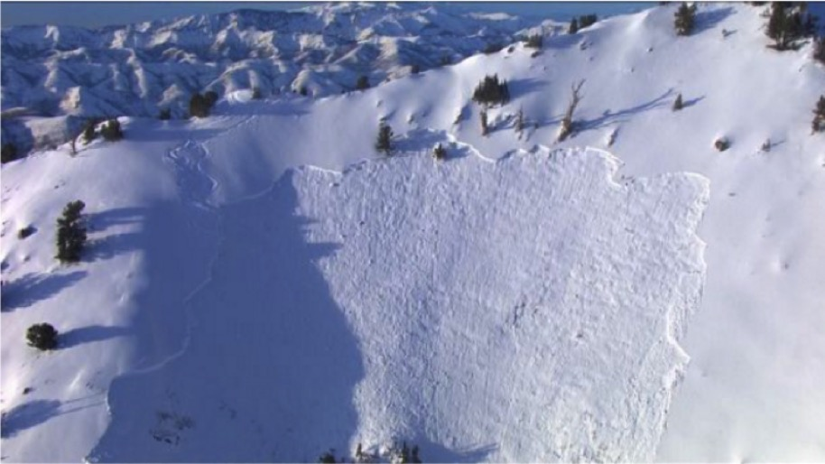  |  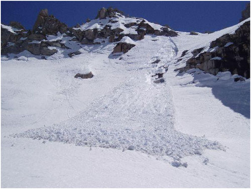|

 __...in progress__
  - stay tuned for part 2 in late May.
  - contact: thedrewthayer@gmail.com
